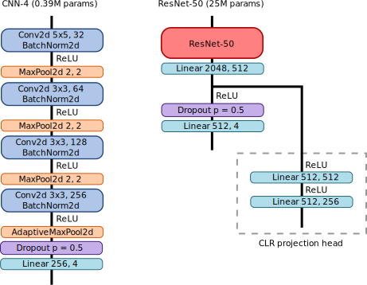

# GrapheneClassifier
Since 2004 [[1]](#1) two-dimensional materials have been one of the most active areas of research in materials science. Two-dimensional materials are commonly prepared by mechanical exfolitation: a non-deterministic procedure where we press a crystal onto a silicon wafer, leaving behind crystal fragments which are occasionally only a few atoms thick. For example, to prepare graphene (a monolayer of carbon atoms) we press graphite crystals onto a silicon wafer. We then use a micrscope to search the debris for graphene flakes that have adhered to the surface. The results of mechanical exfoliation are shown below:

  
*Left: low-magnification image of a silicon wafer after mechanical exfoliation of graphite. Graphite crystals of various thicknesses are shown, along with a monolayer graphene crystal (circled in red). Right: high-magnification image of exfoliated monolayer graphene.*

Depending on the material this search (colloquially termed "flake-hunting") can take several hours. Many research groups have tried to automate the process, but so far no solution has been convenient or reliable enough for widespread adoption. The group I work in at MIT has also put efforts into automated flake-hunting [[2]](#2), and this project is a continuation of that. 

Previous work showed that convolutional neural nets (CNN) can detect two-dimensional materials, but the models were trained on high-magnification images which limits throughput. Here, I discuss some experiments on flake-detection using low-magnification images (each image captures a 2.8mm x 1.9mm region). Another barrier preventing automated flake hunting is the wide variety of materials requirements. Researchers might want to quickly characterize a material that has never been exfoliated before, or to find crystals with a specific shape. Self-supervised pre-training has been shown to improve data-efficiency, so I implemented the SimCLR method for self-supervised contrastive learning [[3](#3), [4](#4)].

### Requirements
Python 3.8.10, Pillow 7.2.0, NumPy 1.19.1, Matplotlib 3.3.4, PyTorch 1.8.1

### Usage

The main module is `train.py` which uses gradient descent to train the model defined by the class `Classifier` in `model.py`. It is designed to be run from the command line. To see the arguments, call `python train.py -h`. Arguments can be passed from file using `@` as a prefix. The module `clr.py` can be run from the command line to carry out contrastive learning, again using the `Classifier` class defined in `model.py`. 

As described in [Big Self-Supervised Models are Strong Semi-Supervised Learners](#4), in SimCLR we train the model with a projection head that outputs a high-dimensional embedding. For supervised fine-tuning we replace this projection head with a linear map that outputs a `num_classes` dimensional vector. This is handled automatically by the `Classifier` class, which can be initialized in either configuration. During training `clr.py` saves weights for the entire model and also weights for the backbone only. To use `train.py` with a pre-trained backbone use the command line argument `--backbone_weights_path`. 

Finally, the model defined in `model.py` is a small CNN with four convolutional layers that is not really appropriate for contrastive learning. `resnet.py` defines a classifier based on ResNet-50; to use it rename this file to `model.py`.

### Results

To train the model I created a dataset of 3756 training images and 683 validation images. The images are 400 x 400 pixel squares cropped from 4908 x 3264 microscope images. The dataset contains: i) selected images of thin graphene/graphite films, ii) selected images of thick graphite crystals and other non-graphene objects on the wafer (residues, dirt, etc.), and iii) randomly cropped regions. For each image, I created labels indicating the non-exclusive presence or absence of three classes:

* Class 1: Graphene films with R channel contrast <= 12% 
* Class 2: Graphene films with R channel contrast >12% and <=19%
* Class 3: Graphene films with R channel contrast >19% and <=30%

Class 1 contains primarily monolayers, Class 2 bilayers and trilayers, and Class 3 from trilayers up to 5-6 layers. The association between classes and layer thickness is approximate and will depend on substrate type and illumination conditions. In addition the models are trained with a fourth class indicating the presence of any class. In the training dataset 13% of images are in Class 1, 14% are in Class 2, 12% are in Class 3, and 26% are in Class 4.

For SimCLR I created a dataset of 117027 200 x 200 images. The images were cropped from 4098 x 3264 images by identifying regions with a sufficiently different color from the median color and cropping a 200 x 200 square around them: regions with contrast corresponding to Class 1-3 and outside this range were chosen in equal numbers.

Below I will compare two methods/architectures for training a graphene classifier: a small CNN trained from scratch on the classifier dataset only (CNN-4) and a ResNet-50 pre-trained with SimCLR and then fine-tuned on the classifier dataset.

CNN-4 was trained for 200 epochs using the AdamW optimizer with `lr=3r-4` and `weight_decay=0.2`. The ResNet-50 was first trained on the contrastive learning dataset for 50 epochs with `lr=3r-4`, `weight_decay=0.3`, and a batch size of 256. Fine-tuning on the classifier dataset was done by first training the linear output layer with the backbone frozen, and then training the entire model for 50 epochs with `lr=1r-5` and `weight_decay=0.01`. The results are summarized below:

*Left: Table of F-scores for the four classess. LE refers to SimCLR plus training of the linear output layer with the backbone frozen, while FT refers to SimCLR plus fine-tuning as described in the text. Right: Harmonic average of F-scores over class versus dataset size for selected models*

CNN-4 and ResNet-50(2X) FT are tied for the best overall performance. To test the data efficiency I re-trained models with reduced training data. Larger models with SimCLR outperform for the smallest dataset (76 training examples) but more data is needed to find the exact crossover point. Based on these results, I decided to focus on using small CNNs trained from scratch for pratical applications, since they have similar performance with much less compute and a more straightforward training regimen. Due to GPU memory constraints, I used a much smaller batch size for SimCLR (256 versus 4096) compared to Ref. [[4]](#4). The largest model I used was ResNet-50(2X) versus their ResNet152(3X). Larger models and batch size were found to be important in SimCLR [[3]](#3) so it's likely those are limiting factors here. 

Currently in our lab we are using small CNNs of the type described here as part of a automated flake-hunting setup. In this setup we use a hand-coded pre-selection algorithm, along with a CNN trained to reject false positives. We have not tested the use of CNNs without this pre-selection step in detail, but could move towards this in the future with more data. For fun, I wrote some code, included here as `scan.py`, to tile an image and draw red boxes aroud any tile where any of Class 1-3 is detected. It seems to do a reasonable job, as illustrated in the image below:

### References
<a id="1">[1]</a> K.S. Novoselov *et al.,* "Electric field effect in atomically thin carbon films", *Science* **306**, 666-669 (2004)

<a id="2">[2]</a> B. Han *et al.,* "Deep-Learning-Enabled Fast Optical Identification and Characterization of 2D Materials", *Advanced Materials* **32**, 2000953 (2020)

<a id="3">[3]</a> T. Chen *et al.,* "A Simple Framework for Contrastive Learning of Visual Representations", arXiv preprint arXiv:2002.05709 (2020)

<a id="4">[4]</a> T. Chen *et al.,* "Big Self-Supervised Models are Strong Semi-Supervised Learners", arXiv preprint arXiv:2006.10029 (2020)
